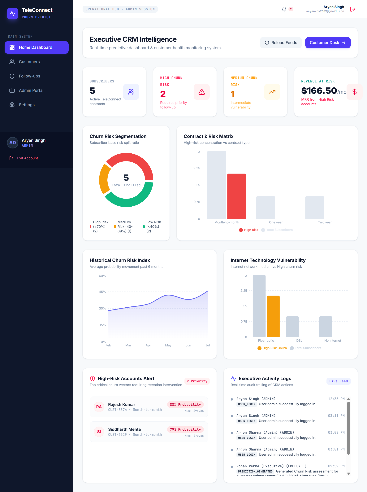
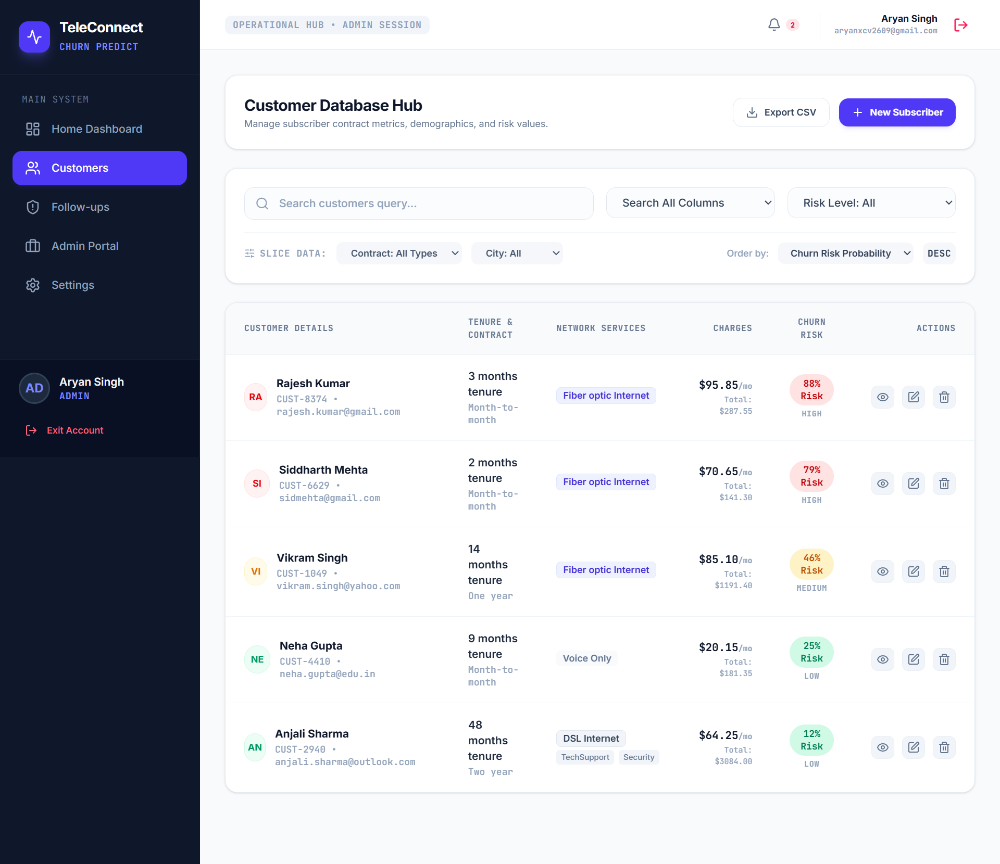
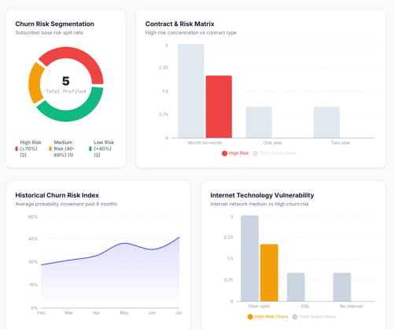
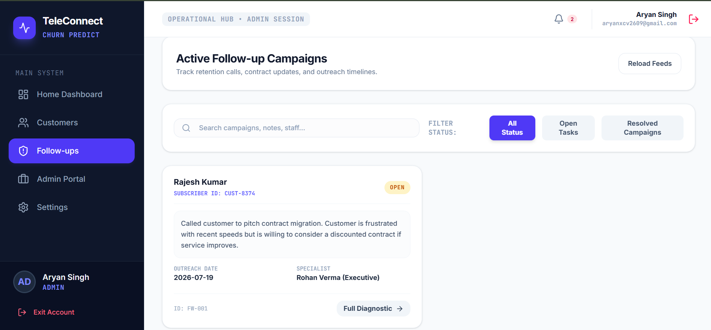
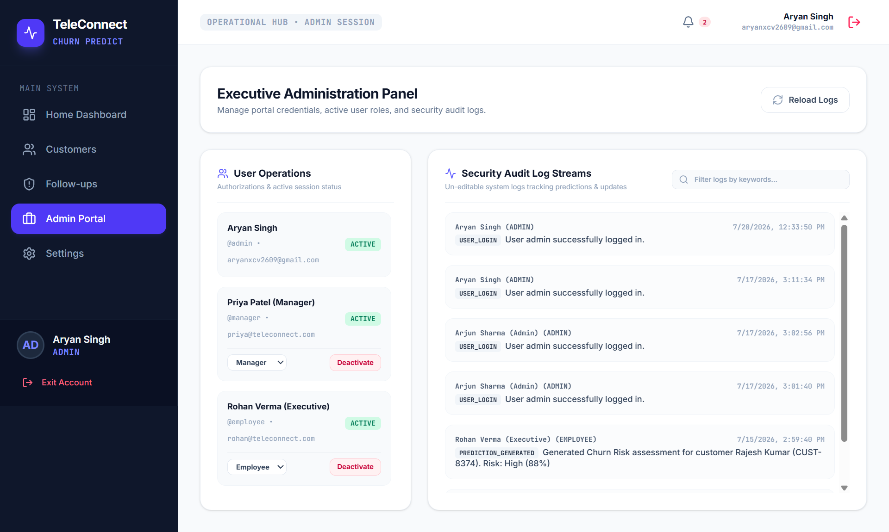

<div align="center">

# 📡 Telecom Customer Churn Prediction System

### 🚀 AI-Powered CRM & Customer Retention Platform

<p align="center">

<a href="https://telecom-customer-churn-prediction-system-cfg0.onrender.com">

</a>

<a href="https://github.com/aryan2609progress/telecom-customer-churn-prediction-system">

</a>

</p>



<br>


---

### 💜 Predict Customer Churn • Manage Customers • Track Follow-ups • Generate AI Insights

*A modern CRM platform that helps telecom companies identify at-risk customers, monitor customer interactions, and improve retention using AI-powered insights.*

</div>

---

# 📖 About

Telecom companies lose thousands of customers every month due to customer churn.

This project provides an intelligent CRM system that enables organizations to:

- 📊 Monitor customer activity
- 🤖 Predict customer churn using AI
- 👥 Manage customer records
- 📞 Track follow-ups
- 📈 Visualize business insights
- 🛡️ Manage users through an Admin Panel

Designed with a clean dashboard and responsive interface, the system helps businesses make smarter customer retention decisions.

---

# ✨ Key Features

## 📊 Executive Dashboard

- Real-time business overview
- Customer statistics
- Revenue insights
- Churn analytics
- Performance metrics

---

## 👥 Customer Management

- Add new customers
- Edit customer details
- Delete customer records
- Search & filter customers
- Organized customer database

---

## 🤖 AI Churn Prediction

- Intelligent churn analysis
- Risk probability scoring
- AI-powered recommendations
- Customer retention suggestions
- Decision support insights

---

## 📞 Follow-up Management

- Schedule follow-ups
- Track customer interactions
- Maintain follow-up history
- Priority-based management

---

## 🛡️ Admin Panel

- User management
- Employee access control
- Role-based permissions
- Secure authentication

---

## ⚙️ Settings

- System configuration
- User preferences
- AI configuration
- Application settings

---

# 🚀 Tech Stack

| Category | Technologies |
|----------|--------------|
| Frontend | React 19, TypeScript, Vite |
| Backend | Node.js, Express.js |
| AI | Google Gemini API |
| Database | JSON Storage |
| Deployment | Render |
| Version Control | Git & GitHub |

---

# 🌟 Why This Project?

✅ Modern Dashboard UI

✅ AI-Powered Customer Churn Prediction

✅ CRM Functionality

✅ Customer Database Management

✅ Follow-up Tracking System

✅ Admin Panel

✅ Responsive Design

✅ Clean Architecture

✅ Beginner Friendly Codebase

✅ Easy Deployment on Render

---
<!-- part 2 -->
# 📸 Application Preview

> **Dashboard**


---

> **Customer Management**



---

> **AI Churn Prediction**



---

> **Follow-up Management**



---

> **Admin Panel**



---

# 🏗️ System Architecture

```text
                    ┌──────────────────────┐
                    │     React + Vite     │
                    │      Frontend        │
                    └──────────┬───────────┘
                               │
                         REST API Calls
                               │
                    ┌──────────▼───────────┐
                    │    Express Backend   │
                    └──────────┬───────────┘
                               │
          ┌────────────────────┼────────────────────┐
          │                    │                    │
          ▼                    ▼                    ▼
 Customer Database      Gemini AI API      Authentication
          │                    │
          └──────────────┬─────┘
                         ▼
              Churn Prediction Engine
                         │
                         ▼
              AI Recommendations
```

---

# 🚀 Getting Started

## Clone Repository

```bash
git clone https://github.com/aryan2609progress/telecom-customer-churn-prediction-system.git
```

## Open Project

```bash
cd telecom-customer-churn-prediction-system
```

## Install Dependencies

```bash
npm install
```

## Configure Environment

Create a `.env` file in the project root.

```env
GEMINI_API_KEY=YOUR_API_KEY
```

## Run Development Server

```bash
npm run dev
```

Visit

```
http://localhost:5173
```

---

# 📂 Project Structure

```text
telecom-customer-churn-prediction-system
│
├── assets/
│   └── screenshots/
│
├── public/
│
├── src/
│   ├── components/
│   ├── pages/
│   ├── hooks/
│   ├── services/
│   ├── utils/
│   ├── styles/
│   └── App.tsx
│
├── server.ts
├── server-db.ts
├── package.json
├── vite.config.ts
└── README.md
```

---

# 🔄 Application Workflow

```text
             Login
               │
               ▼
      Executive Dashboard
               │
      ┌────────┼────────┐
      ▼        ▼        ▼
 Customers  AI Engine  Analytics
      │
      ▼
 Follow-up Manager
      │
      ▼
 Customer Retention
```

---

# 📊 Core Modules

| Module | Description |
|---------|-------------|
| 🔐 Authentication | Secure user login |
| 📊 Dashboard | Business overview & analytics |
| 👥 Customer Management | Add, update & manage customers |
| 🤖 AI Prediction | Predict customer churn |
| 📞 Follow-up | Manage customer interactions |
| 🛡️ Admin Panel | User & role management |
| ⚙️ Settings | Configure application |

---

# 🤖 AI Capabilities

- Predict customer churn probability
- Identify high-risk customers
- Generate intelligent recommendations
- Assist customer retention strategies
- Improve business decision making

---

# 🌐 Live Demo

### 🚀 Hosted on Render

https://telecom-customer-churn-prediction-system-cfg0.onrender.com

---

# 📈 Highlights

- 📊 Interactive Dashboard
- 🤖 AI-Powered Insights
- 👥 CRM Management
- 📞 Follow-up Tracking
- 🛡️ Admin Controls
- 📱 Responsive Design
- ⚡ Fast Performance
- ☁️ Easy Deployment
<!-- part 3 -->

# 🚀 Future Enhancements

The project can be further enhanced with enterprise-level features such as:

- ☁️ MongoDB / PostgreSQL Integration
- 📱 Mobile Application (Android & iOS)
- 📧 Email Notifications
- 📲 WhatsApp & SMS Integration
- 🔔 Push Notifications
- 📄 PDF & Excel Report Generation
- 📊 Advanced Business Analytics
- 🤖 AI Chatbot for Customer Support
- 🔐 JWT Authentication
- 👥 Multi-Role Access Control
- 🌍 Multi-Language Support
- 📈 Real-Time Dashboard Updates
- 🧠 Machine Learning Model Integration

---

# 💡 Learning Outcomes

This project demonstrates practical knowledge of:

- React.js
- TypeScript
- Express.js
- REST APIs
- AI Integration (Google Gemini)
- CRM System Development
- Dashboard Design
- Customer Analytics
- Authentication
- Deployment on Render
- Version Control with Git & GitHub

---

# 🤝 Contributing

Contributions are always welcome!

If you'd like to improve this project:

```bash
# Fork the repository

# Create a new branch
git checkout -b feature/new-feature

# Commit changes
git commit -m "Added new feature"

# Push changes
git push origin feature/new-feature
```

Finally, create a Pull Request.

---

# 🐞 Report Issues

Found a bug or have a suggestion?

Please open an Issue on GitHub with:

- Bug Description
- Steps to Reproduce
- Expected Result
- Screenshots (if applicable)

---

# 📜 License

This project is licensed under the **MIT License**.

Feel free to use and modify it for learning and educational purposes.

---

# 👨‍💻 Developer

## Aryan Singh

**B.Tech Computer Science Engineering Student**

### Interests

- 🤖 Artificial Intelligence
- 🧠 Machine Learning
- 🌐 Full Stack Development
- 📊 Data Science
- 🚀 Open Source

---

# 🌐 Project Links

### 🚀 Live Demo

https://telecom-customer-churn-prediction-system-cfg0.onrender.com

### 💻 GitHub Repository

https://github.com/aryan2609progress/telecom-customer-churn-prediction-system

### 👤 GitHub Profile

https://github.com/aryan2609progress

---

# 🙏 Acknowledgements

Special thanks to:

- React Team
- Node.js Community
- Express.js
- Google Gemini AI
- Vite
- Render
- GitHub
- Open Source Community

---

<div align="center">

## ⭐ If you found this project helpful, please consider giving it a Star!

**Made with ❤️ using React, TypeScript, Express.js & Google Gemini AI**


<br><br>

### ⭐ Thank you for visiting this repository!

</div>